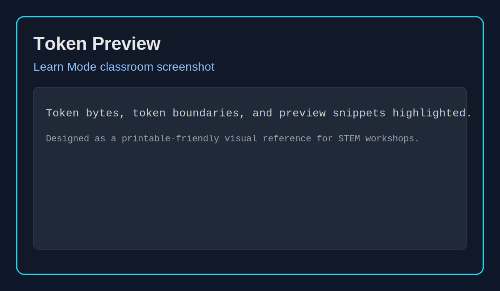
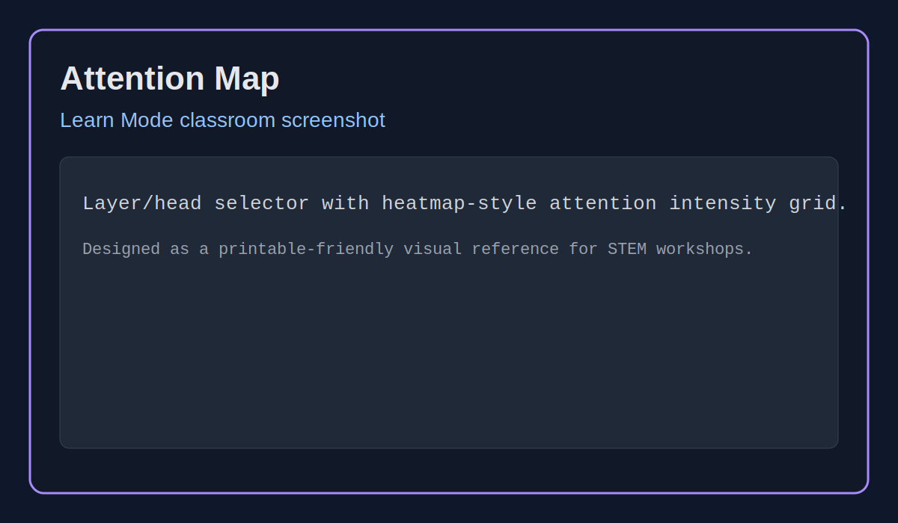
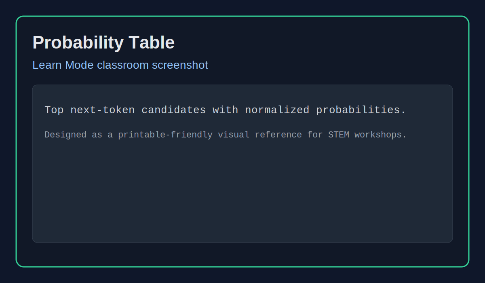
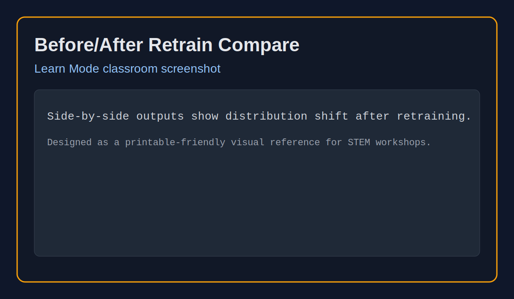

<p align="center">
  
</p>
<p align="center">
  <strong>Build it. Train it. Talk to it. Retrain it. Understand it.</strong>
</p>
<p align="center">
  <a href="README.md">Home</a> • <a href="docs/first_lesson_walkthrough.md">First Lesson</a> • <a href="docs/teacher_guide.md">Teacher Guide</a> • <a href="docs/student_worksheet.md">Student Worksheet</a> • <a href="docs/architecture.md">Architecture</a> • <a href="docs/how_llms_work.md">How LLMs Work</a>
</p>

---

# Kairo

Kairo is a hands-on educational GPT lab that helps learners inspect how language models actually work.

## The idea

Kairo makes model behaviour visible:

- tokenisation
- next-token prediction
- probabilities
- attention
- retraining effects

Instead of treating AI like magic, Kairo exposes the mechanics directly.

## Why it exists

Many learners meet AI through polished products that hide the mechanics.

Kairo exists to make those mechanics:

- concrete
- testable
- discussable
- visible in a classroom

## The magic moment

Retrain Kairo on pirate stories and watch the model immediately start speaking differently.

Same model. Different data. Different behaviour.

That moment is where many learners suddenly understand what a language model actually is.

The model did not become “smarter”.

It changed because the training data changed.

This is where LLMs stop feeling like magic and start feeling understandable.

## The learning loop

| Step          | Learner action                      | Concept learned              |
| ------------- | ----------------------------------- | ---------------------------- |
| Build it      | Pick training text                  | Tokens and dataset shape     |
| Train it      | Run a tiny transformer              | Loss and pattern learning    |
| Talk to it    | Prompt the model                    | Sampling and uncertainty     |
| Retrain it    | Change the data                     | Distribution shift           |
| Understand it | Inspect probabilities and attention | Influence, not understanding |

## Simple architecture


```text
Training text
↓
Byte tokenizer
↓
Sequence dataset
↓
TinyGPT
↓
Loss and updates
↓
Generation and inspection
```

## Installation

Run:

```bash
python -m venv .venv
source .venv/bin/activate
pip install -e .
```

Optional Learn Mode:

```bash
pip install -e ".[learn]"
```

## Try it in 3 minutes

Train:

```bash
python src/train.py --input_file data/samples/space_adventure.txt --out_dir runs/demo --epochs 1 --batch_size 4 --seq_len 32 --d_model 64 --n_heads 4 --n_layers 2 --device cpu
```

Generate:

```bash
python src/generate.py --checkpoint runs/demo/best.pt --prompt "The robot opened the door" --max_new_tokens 20 --device cpu
```

Evaluate:

```bash
python src/evaluate.py --checkpoint runs/demo/best.pt --input_file data/samples/space_adventure.txt --device cpu
```

Chat:

```bash
python src/chat.py --checkpoint runs/demo/best.pt --device cpu
```

## What you should see

With tiny datasets and tiny models, you should expect:

- short repetitive phrases
- unstable grammar
- occasional nonsense
- noticeable style shifts after retraining

That weirdness is the point: it reveals the mechanism.

## Learn Mode

Launch interactive Learn Mode:

```bash
streamlit run src/kairo_learn.py
```

You can walk students through:

- token previews
- training curves
- next-token probabilities
- attention maps
- retrain-and-compare experiments


## Learn Mode screenshots

- Token preview: 
- Attention maps: 
- Probability tables: 
- Before/after retrain comparisons: 

## Why byte-level tokens?

Byte-level tokenisation is:

- simple
- deterministic
- easy to visualise
- suitable for any text

Production models often use more advanced tokenisers, but byte-level tokens make the mechanics easier to inspect.

## Expected weirdness

Tiny models frequently:

- copy chunks from training text
- overfit quickly
- drift off-topic
- contradict themselves
- repeat phrases

These are valuable teaching moments, not failures.

## Common misconceptions

- Low loss means intelligence: No, it means lower prediction error.
- Attention is reasoning: No, it is weighting over previous tokens.
- The model knows facts: No, it predicts plausible continuations.
- Generated text means understanding: No, it means the model learned patterns.

## Classroom use

Kairo works for:

- teacher-led demos
- pair labs
- short workshops
- independent experiments
- STEM clubs

Start with:

- [First Lesson Walkthrough](docs/first_lesson_walkthrough.md)
- [Teacher Guide](docs/teacher_guide.md)
- [Student Worksheet](docs/student_worksheet.md)

### Printable lesson packs

- [Teacher Guide (PDF)](docs/printable/teacher_guide.pdf)
- [Student Worksheet (PDF)](docs/printable/student_worksheet.pdf)
- [First Lesson Walkthrough (PDF)](docs/printable/first_lesson_walkthrough.pdf)

### New sample datasets

- [Pirate dialogue](data/samples/pirate_dialogue.txt)
- [Sci-fi micro-story](data/samples/sci_fi_micro_story.txt)
- [Short poems](data/samples/short_poems.txt)

## Safety and supervision

Kairo includes lightweight classroom-safe checks, but it is not fully moderated.
Teacher supervision is required.
Kairo is not suitable for unsupervised public deployment.

## What Kairo is not

Kairo is not:

- a production chatbot
- a benchmark-leading model
- an autonomous agent
- a replacement for critical thinking
- a fully moderated child-safety system

It is a learning tool for inspecting core LLM mechanics.

## Developer quickstart

```bash
ruff check .
python -m compileall src tests
pytest -q
```

## Documentation map

- [First Lesson Walkthrough](docs/first_lesson_walkthrough.md)
- [Teacher Guide](docs/teacher_guide.md)
- [Student Worksheet](docs/student_worksheet.md)
- [Architecture](docs/architecture.md)
- [How LLMs Work](docs/how_llms_work.md)
- [Simple architecture flowchart](docs/assets/simple-architecture-flowchart.svg)
- [Learn Mode token preview screenshot](docs/assets/learn-mode-token-preview.svg)
- [Learn Mode attention map screenshot](docs/assets/learn-mode-attention-map.svg)
- [Learn Mode probability table screenshot](docs/assets/learn-mode-probability-table.svg)
- [Learn Mode retrain comparison screenshot](docs/assets/learn-mode-retrain-compare.svg)
- [Teacher Guide PDF](docs/printable/teacher_guide.pdf)
- [Student Worksheet PDF](docs/printable/student_worksheet.pdf)
- [First Lesson Walkthrough PDF](docs/printable/first_lesson_walkthrough.pdf)
- [Pirate dialogue dataset](data/samples/pirate_dialogue.txt)
- [Sci-fi micro-story dataset](data/samples/sci_fi_micro_story.txt)
- [Short poems dataset](data/samples/short_poems.txt)

## Roadmap

Future educational improvements:

- richer attention visuals
- clearer experiment comparison UI
- more classroom-ready sample datasets
- additional explainability activities
- printable lesson packs
- screenshots and walkthrough images

---

<p align="center">
  <a href="README.md">Home</a> • <a href="docs/first_lesson_walkthrough.md">First Lesson</a> • <a href="docs/teacher_guide.md">Teacher Guide</a> • <a href="docs/student_worksheet.md">Student Worksheet</a> • <a href="docs/architecture.md">Architecture</a> • <a href="docs/how_llms_work.md">How LLMs Work</a>
</p>
